# System Thinking Ads Data Summary

## Data Overview

This repo has two main processed datasets for the System Thinking ads analysis:

- `data/sys_think/processed/campaign-summary.csv` — date-bounded campaign configurations derived from Google Ads change history (what the marketing team set in the UI: budget, keywords, match types, negatives, pauses).
- `data/sys_think/processed/kw-day-panel.csv` — keyword-day performance from Google Ads Search keyword reports.

The exploratory notebook is [`eda_clicks_budget_keywords.ipynb`](eda_clicks_budget_keywords.ipynb). For modeling clicks and spend against daily budget, those two files are rolled up into `campaign-day-panel.csv` (one row per active campaign-day, keyed by `campaign_version`).

### `campaign-summary.csv`

Each row is one **campaign version**: a contiguous window where the campaign’s marketing inputs were unchanged. Versions are built by parsing the saved Google Ads change-history HTML (`scripts/parse_change_history_html.py`), cross-checked against the raw Search keyword export for positive keywords and match-type counts. Budget, negatives, pause/reactivation, and renames come from change history.

Key columns:

- `campaign_version`: version identifier (links to `campaign-day-panel.csv`).
- `campaign`: Google Ads campaign name (region is inferred from this).
- `start_date` / `end_date`: active window for this configuration (`end_date` blank if still open).
- `change_type`: what triggered the version (e.g. `daily_budget`, `raw_keyword_coverage`, keyword add/remove, pause/active).
- `region`: `A`, `B`, `C`, or `USA` (parsed from campaign name).
- `daily_budget`: daily budget in USD.
- `match_types`: campaign-level match configuration (`Broad`, `Phrase; Exact`, `Exact`, `Broad; Phrase; Exact`).
- `keyword_set_id`: pointer to positive/negative keyword lists in `campaign-keyword-sets.csv`.
- `num_unique_keywords`, `broad_keyword_count`, `phrase_keyword_count`, `exact_keyword_count`: keyword inventory for that set.
- `num_negative_keywords`: negative keyword count when negatives changed.

Current coverage:

- Versions: **47** campaign configurations across **11** campaign names.
- Keyword sets: **25** distinct `keyword_set_id` values (full lists in `campaign-keyword-sets.csv`; budget-only changes reuse the same set).
- Date range: **2024-06-26** to **2026-05-12** (`start_date` span; closed windows end as late as 2026-05-12).
- Regions: **A** (13 versions), **B** (13), **USA** (17), **C** (4).
- Match configurations: **4** campaign-level settings — `Broad`, `Phrase; Exact`, `Exact`, `Broad; Phrase; Exact`.
- Daily budget range: **$6.18** to **$296.47** (33 distinct levels).
- Keywords per version: **6–115** unique positives; negatives **0–1,339** per version.

A `campaign_version` is a date-bounded configuration from `campaign-summary.csv`, determined by `(region, daily_budget, match_types, keyword_set_id)`. `keyword_set_id` captures the positive and negative keyword configuration in effect during that window. A new version is created when any of those elements changes (budget, match/keyword set, pause/reactivation, keyword add/remove, or initial raw keyword coverage). When the campaign-day panel is built, each active campaign-day is matched to the summary row whose date window contains that day.

### `kw-day-panel.csv`

Keyword-level dataset from the Google Ads **Search keyword** report (`scripts/process_input_data.py`). Used for keyword selection, concentration checks, cross-region overlap, and quality rankings.

Key columns:

- `date`: reporting date.
- `region`: campaign region bucket (`A`, `B`, `C`, `USA`).
- `keyword`: keyword text.
- `campaign`: source campaign name.
- `match_type`: keyword-level match type (`Broad`, `Phrase`, `Exact`).
- `clicks`: daily keyword clicks.
- `cost`: daily keyword cost.
- `all_conv`: All conversions for the keyword-day (view-through included).

Current coverage (last two years, aligned with campaign-summary):

- Rows: **36,572** keyword-days.
- Date range: **2024-06-26** to **2026-05-13**.
- Regions: `A`, `B`, `C`, `USA`.
- Match types: `Broad`, `Phrase`, `Exact`.

Related files: `campaign-keyword-sets.csv` (25 keyword sets with full positive/negative lists), `campaign-day-panel.csv` (2,222 campaign-days aggregated from the summary + keyword report for budget–click modeling). The panel inherits **`match_types` from `campaign-summary`** (4 campaign-level configurations), yielding **12** `(region, match_types)` segments.

## Plan

1. Select a fixed keyword set per `(region, match_type)` campaign.
2. Model clicks as a function of budget and features.
3. Allocate budget across campaigns using marginal returns.

---

## EDA Findings

### Keyword count vs clicks
Correlation between `num_unique_keywords` and clicks-per-day ≈ 0.05–0.08 (negligible). Keyword *quality* and match type matter more than count.

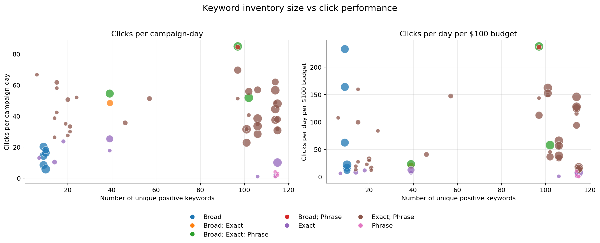

*Plot note:* Each point is **one campaign version** (joined from `campaign-summary.csv` to aggregated clicks over its active days). The x-axis is `num_unique_keywords`; the y-axis is clicks/day or clicks per $100 budget. **Point size** scales with √(number of campaign-days) for that version (larger = longer observation window), not with click volume.

### Budget vs clicks
Clicks increase with budget but slopes differ substantially by region and match type. Region B achieves strong volume at low budgets; USA requires high budgets for modest relative gains.

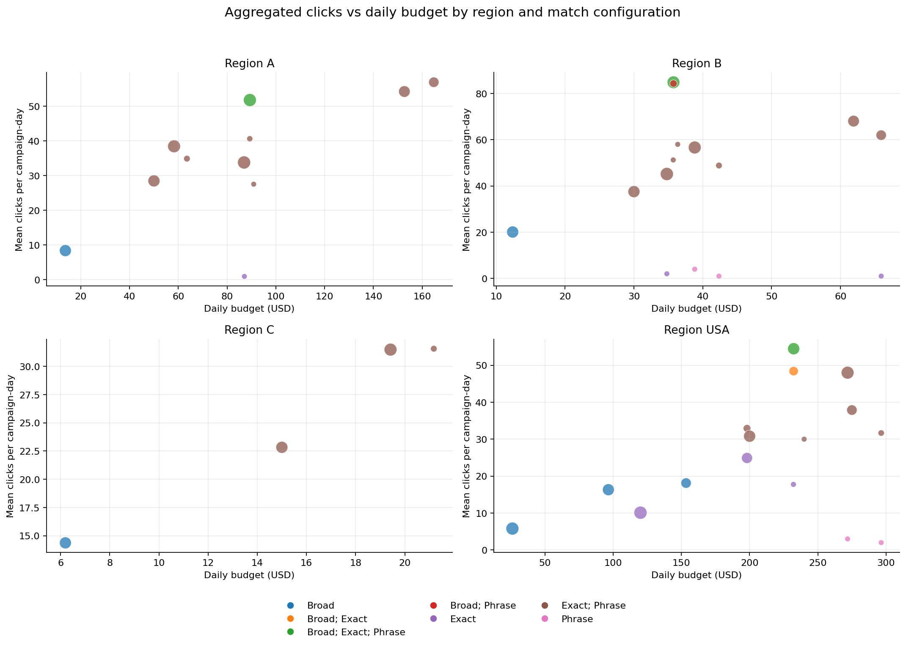

*Plot note:* **Aggregated** view — each point is one `(region, match_types, daily_budget)` cell (mean/median clicks across all campaign-days at that budget level). **Point size** is the count of campaign-days in that cell, so repeated budget levels are easier to read than plotting every raw campaign-day.

---

## Feasibility Analyses

### Budget-response curve viability
Only 5 of 12 segments have ≥3 distinct historical budget levels. Per-segment curve fits (linear and power-law):

| Segment | Days | Budget levels | R² (power) | Power b |
|---|---|---|---|---|
| A / Phrase; Exact | 359 | 7 | 0.21 | 0.46 |
| B / Phrase; Exact | 362 | 7 | 0.17 | 0.51 |
| USA / Phrase; Exact | 346 | 7 | 0.55 | 1.47 |
| USA / Broad | 226 | 3 | 0.52 | 0.63 |
| C / Phrase; Exact | 187 | 3 | 0.24 | 1.18 |

All 7 remaining segments have a single historical budget level and cannot support independent curve fitting, but contribute anchor points to the pooled model.

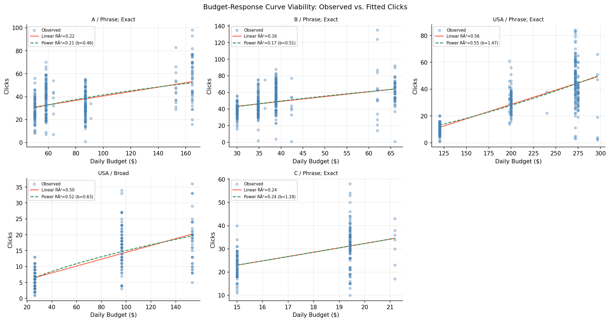

*Plot note:* One panel per `(region, match_types)` segment with enough budget variation. **Each dot is one campaign-day** (daily budget vs clicks). Solid/dashed curves are linear and power-law fits on those days.

### Temporal stability
Click rates (clicks/budget) show level shifts at keyword-set boundaries in all data-rich segments. No uniform secular trend, but patterns are segment-specific. Implication: restrict training to the most recent keyword-set window or include keyword-set FEs.

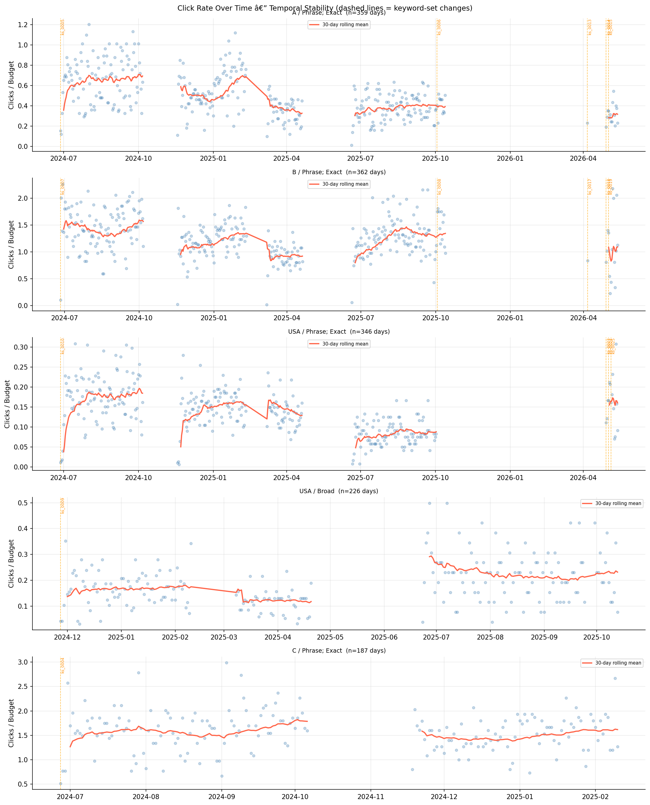

*Plot note:* Daily **click rate** (clicks ÷ daily budget) over time for data-rich segments. **Vertical dashed lines** mark keyword-set change dates (new `keyword_set_id` in `campaign-summary.csv`).

### Keyword-set semantic features and stability

We summarize each keyword list with **set-level semantic features** instead of modeling individual keywords. There are **25** distinct keyword sets across **47** campaign versions — too many lists to treat keyword-by-keyword in a stable regression, and we care about **shared properties** of a set (cohesion, topical focus) that may explain performance across versions. Individual keywords are hard to isolate: they share ads and landing pages within a campaign, compete in the same auctions, co-move when budget or match type changes, and swap in/out between versions — so a single keyword’s lift is confounded with list composition and campaign-level shifts.

**Semantic features** (one row per `keyword_set_id`, from BERT embeddings `all-MiniLM-L6-v2`, cached at `data/sys_think/processed/keyword_embeddings.parquet`):

- `embed_cohesion` — mean pairwise cosine similarity among keywords in the set.
- `embed_dispersion` — 1 − cohesion.
- `embed_course_sim_mean` / `embed_course_sim_p90` — similarity to course-name anchors (*system thinking*, *systems thinking*, *MIT xPRO system thinking*, *MIT xPRO systems thinking*).

Different lists get different values; all 25 sets have distinct `embed_cohesion` in the current data. Budget-only version splits intentionally **reuse** the same `keyword_set_id` (same features) when only daily budget changed.

**Set turnover** — keywords change substantially between consecutive campaign versions. Across 13 consecutive keyword-set transitions in 4 segments:

- **Median Jaccard** between consecutive sets: **0.39**
- **Median % of prior keywords retained**: **43%** — more than half the list typically turns over
- **7 of 13 transitions** replaced >50% of keywords
- One transition (B: ks_0017 → ks_0018) was a complete reset: 0% overlap, 24 keywords fully replaced by 6 different ones

The pattern is consistent across segments: early transitions involve large pruning events (e.g. A: 106 → 46, B: 114 → 57, USA: 115 → 14 keywords) followed by smaller incremental adjustments. Later transitions are more stable — USA / Phrase; Exact converges to Jaccard 0.67–0.75 after the initial cull.

**Why top-N strict intersection looks sparse**: requiring a keyword to appear in the top-20 of *every* historical version is too strict because of these pruning cycles. A looser criterion (top-20 in ≥3 of 4 substantial versions) yields 13 reliable keywords for B / Phrase; Exact: `what is system thinking`, `project management cert`, `lms learning program`, `critical thinking and problem solving`, `systems thinking course`, `system design`, and others.

**Practical implication**: use the most recent stable set per segment (ks_0015 for A, ks_0019/ks_0008 for B, ks_0022/ks_0025 for USA) as the starting point, validated against top-click and top-efficiency lists from `kw-day-panel.csv` within that version's date window.

### Keyword quality ranking
Cross-region top-20 overlap (by Broad clicks): 6 keywords appear in all 4 regions: `best critical thinking courses`, `business systems course`, `project management cert`, `system design certification`, `system dynamics course`, `systems thinking course`. Exact match has 22+ cross-region keywords. Efficiency rankings (clicks/$100) diverge from volume rankings.

### Power-law marginal returns (per-segment)
Marginal clicks/$1 at current operating budgets (power-law model, b<1 = diminishing returns):

| Segment | Budget | Power b | R² (power) | Marginal |
|---|---|---|---|---|
| B / Phrase; Exact | $36.36 | 0.51 | 0.17 | **0.66** |
| A / Phrase; Exact | $90.91 | 0.46 | 0.21 | 0.20 |
| USA / Phrase; Exact | $159.05 | 1.47 | 0.55 | 0.18 |
| USA / Broad | $26.09 | 0.63 | 0.52 | 0.16 |
| C / Phrase; Exact | $15.00 | 1.18 | 0.24 | 1.81 |

B / Phrase; Exact returns ~3× the marginal clicks/dollar of A and USA / Phrase; Exact at recent (30-day median) budgets. Use power-law marginals as directional only (modest R²).

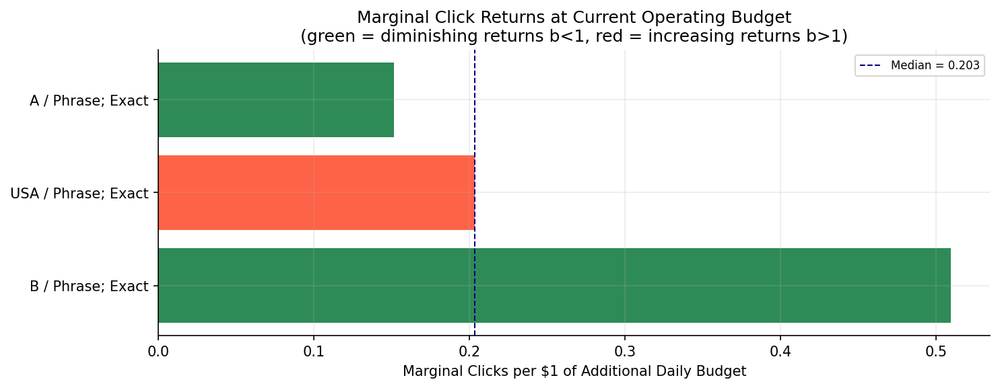

*Plot note:* **Horizontal bars** (not a scatter): one bar per segment with a fitted power-law curve. Height is the **marginal clicks per $1** of daily budget at that segment’s recent (30-day median) budget — the derivative of the power-law fit, not a per-day dot.

---

## Pooled Budget-Response Models

### Log-linear pooled model (M1–M3)

$$\log(\text{clicks}) = \alpha_{\text{region}} + \mu_{\text{match\_type}} + b \cdot \log(\text{budget}) + \varepsilon$$

Uses all 2,222 campaign-days and all 12 segments simultaneously. Single-budget segments contribute precise anchor points; shared elasticity b is identified from cross-segment budget variation.

| Model | Description | R² | AIC | RMSE (log) |
|---|---|---|---|---|
| M1 | Shared b | 0.658 | 3,015 | 0.476 |
| M2 | b × match-type group | 0.661 | 3,007 | 0.475 |
| M3 | b × region | **0.664** | **2,983** | 0.472 |

**M1 pooled elasticity: b = 0.745** (95% CI [0.691, 0.798]) → 10% more budget ≈ 7.4% more clicks. **M3** is preferred by AIC for clicks; match-type interaction on b is also significant (F-test p ≈ 0.003).

Per-region elasticity (M3): C=0.59, B=0.59, A=0.66, USA=0.82.

**Residuals** reject normality (heavy tails, negative skew); point estimates are usable but uncertainty intervals are approximate.

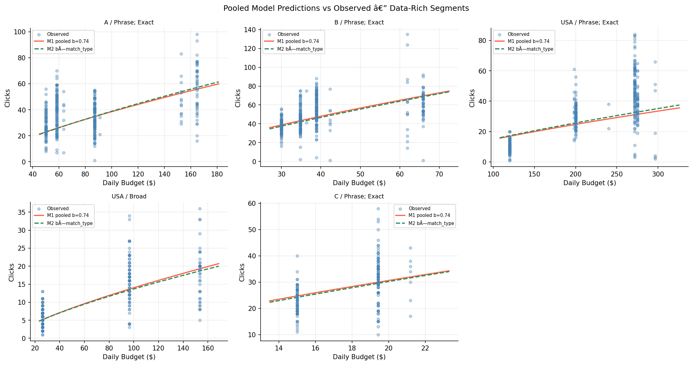

*Plot note:* Data-rich segments only. **Each dot is one campaign-day** (budget vs clicks). Lines are M1/M2 pooled log-linear predictions over a budget grid.

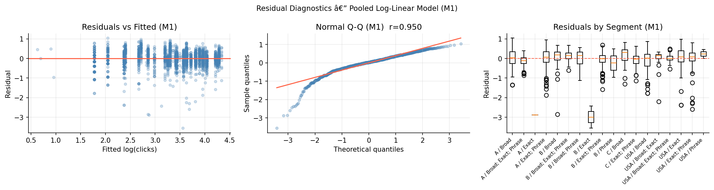

*Plot note:* M1 residuals on **campaign-days** — scatter vs fitted log(clicks), normal Q-Q, and boxplots **grouped by segment** (12 region × match-config cells).

### Linear model with features (M4)

Added temporal and keyword features (following `ad_opt` feature set):

| Feature | Note |
|---|---|
| `day_of_week`, `is_weekend`, `month` | From date |
| `is_public_holiday` | Region-mapped country (US/GB/SG); ~2–4% of days |
| `days_to_next_course_start` | Range: 0–174 days in sample |
| `embed_cohesion/dispersion/course_sim_*` | One value per `keyword_set_id` (not per day); joined to campaign-days via `campaign_version` → `keyword_set_id` |

Not yet available: GKP search volume trends, competition index, bid ranges (require a separate data pull).

| Model | Description | R² | RMSE (clicks) |
|---|---|---|---|
| M4a | Linear, shared slope + features | 0.667 | 13.50 |
| M4b | Linear, per-segment slopes + features | **0.737** | **12.04** |

*(AIC is not comparable across log-log and level-level models.)*

**Significant features in M4b** (temporal, by t-stat): Monday (+6.9, ***), September (+10.9, ***), Tuesday (+5.4, ***), November (+10.2, ***), August (+9.1, ***), July (+9.2, ***), Thursday (+3.9, ***), February (+6.8, ***); `is_public_holiday` (−3.5, *); `embed_course_sim_p90` (+313, **).

**Per-segment marginal returns from M4b** (clicks/$1 of daily budget):

| Segment | Marginal |
|---|---|
| C / Broad | **2.38** |
| C / Phrase; Exact | 1.16 |
| B / Phrase; Exact | 0.73 |
| USA / Broad; Phrase; Exact | 0.64 |
| B / Broad | 0.58 |
| USA / Exact | 0.29 |
| A / Phrase; Exact | 0.25 |
| USA / Phrase; Exact | 0.22 |
| USA / Broad | 0.17 |
| A / Broad; Phrase; Exact | 0.15 |
| B / Broad; Phrase; Exact | −0.35 (single-budget, unreliable) |

Negative slopes on data-sparse segments (e.g. B/Broad, C/Broad) are unreliable; those segments have a single historical budget and their slope is extrapolated noise.

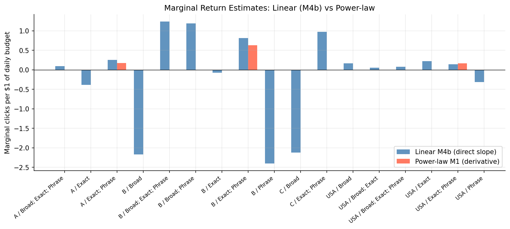

*Plot note:* **Paired bars per segment** — blue = linear M4b slope (clicks per $1 budget); red = power-law marginal from Analysis 1. Not a scatter of daily observations.

---

---

## All-Conversions Analysis

The same analyses were repeated using **All conv.** (total tracked conversions, including view-through) as the outcome variable, drawn from the `Search keyword - raw input to models - all conv.csv` report. This is a parallel analysis to the clicks-based EDA above; all model structures are identical.

### Data overview

The all-conv report covers 21 distinct campaign names (including experiment variants not in the processed campaign-day panel). After mapping to `(region, match_types)` and joining daily budget from `campaign-day-panel.csv`:

| Metric | Value |
|---|---|
| Campaign-days matched | 1,604 |
| Date range | 2024-06-27 to 2026-05-13 |
| Total all conv. | 4,078.6 |
| Zero-conv days | 587 / 1,604 (36.6%) |
| Overall conv/click rate | 8.0% |

Zero-conv days are much more prevalent than zero-click days, reflecting the rarity of conversion events relative to clicks.

Per-segment daily conversion distribution:

| Segment | Days | Mean conv/day | Median | Max |
|---|---|---|---|---|
| B / Phrase; Exact | 416 | 4.36 | 3.00 | 35 |
| A / Phrase; Exact | 417 | 3.78 | 2.04 | 27 |
| USA / Broad | 226 | 0.79 | 0.00 | 19 |
| C / Phrase; Exact | 187 | 1.07 | 0.00 | 9 |
| USA / Exact | 111 | 1.23 | 0.50 | 11 |
| A / Broad | 77 | 0.25 | 0.00 | 2 |
| B / Broad | 78 | 1.28 | 1.00 | 6 |
| C / Broad | 77 | 0.36 | 0.00 | 3 |

### Budget-response curve viability (all conv.)

Only 4 of 12 segments have ≥3 distinct budget levels (vs 5 for clicks). R² values are substantially lower than the clicks equivalents, reflecting the higher noise in conversion counts.

| Segment | Days | Budget levels | R² (linear) | R² (power) | Power b |
|---|---|---|---|---|---|
| A / Phrase; Exact | 417 | 8 | 0.10 | 0.10 | 0.77 |
| B / Phrase; Exact | 416 | 8 | 0.09 | 0.09 | **0.975** |
| USA / Broad | 226 | 3 | 0.03 | 0.03 | 0.62 |
| C / Phrase; Exact | 187 | 3 | 0.01 | 0.01 | 1.36 |

B / Phrase; Exact has a near-linear conversion response (b≈1), unlike its sub-linear click response (b≈0.51). This suggests conversions are not yet saturating at current B budgets.

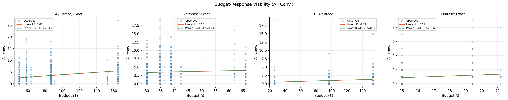

### Power-law marginal conversion returns

| Segment | Budget | Power b | R² | Marginal conv/$1 |
|---|---|---|---|---|
| B / Phrase; Exact | $61.90 | 0.975 | 0.09 | **0.099** |
| A / Phrase; Exact | $152.70 | 0.77 | 0.10 | 0.029 |

B delivers 3.5× more marginal conversions per dollar than A at current budgets. The low R² values are expected for conversion data — use these as directional estimates only.

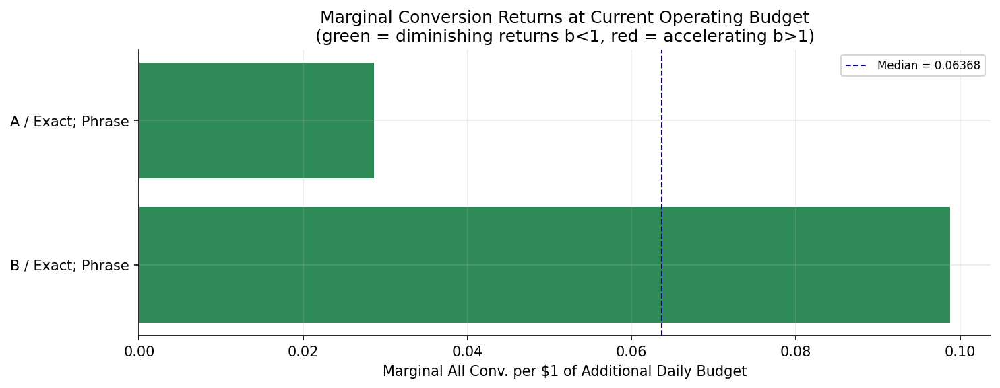

### Pooled log-linear conversion models (M1–M3)

Zero-conv days are dropped (log undefined): 587 days dropped (36.6%), leaving 1,017 rows.

$$\log(\text{all conv.}) = \alpha_{\text{region}} + \mu_{\text{match\_type}} + b \cdot \log(\text{budget}) + \varepsilon$$

| Model | Description | R² | AIC | RMSE (log) |
|---|---|---|---|---|
| M1 | Shared b | 0.197 | 2,479 | 0.816 |
| M2 | b × match-type group | 0.199 | 2,479 | 0.815 |
| **M3** | **b × region** | **0.209** | **2,470** | **0.811** |

**M1 pooled elasticity: b = 0.506** (95% CI [0.375, 0.637]) → 10% more budget ≈ 4.9% more conversions. This is notably lower than the click elasticity (b = 0.683), meaning additional budget translates less efficiently to conversions than to clicks.

M3 is preferred by AIC (Δ9 over M1). Per-region elasticity:

| Region | b (conversions) | b (clicks, for comparison) |
|---|---|---|
| B | 0.758 | 0.53 |
| A | 0.583 | 0.60 |
| C | 0.475 | 0.35 |
| USA | 0.206 | 0.73 |

USA conversion elasticity is strikingly low (0.21) compared to its click elasticity (0.73), suggesting USA traffic converts poorly despite volume responsiveness to budget. B shows the reverse: higher conversion elasticity than click elasticity.

M2 (b × match-type) is not significant (F-test p = 0.15) — match type does not significantly modulate conversion elasticity.

Overall model fit is much weaker than the clicks equivalents (R² 0.20 vs 0.74). Conversions are noisier and more dependent on factors not captured by budget alone.

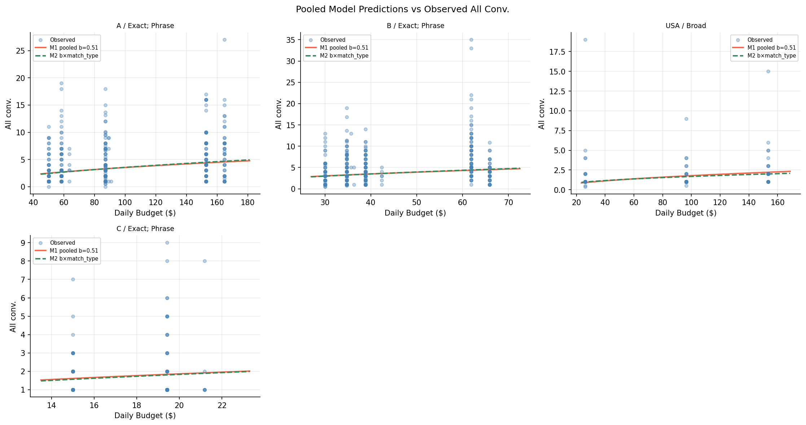
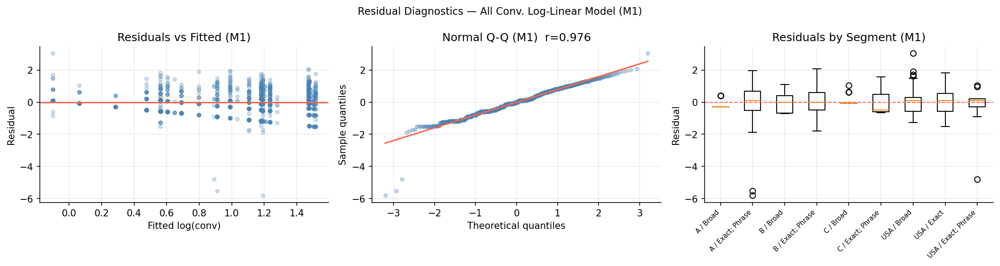

### Linear model with features (M4a / M4b, all conv.)

| Model | Description | R² | RMSE (conv) |
|---|---|---|---|
| M4a | Linear, shared slope + features | 0.297 | 3.085 |
| **M4b** | **Linear, per-segment slopes + features** | **0.340** | **2.994** |

F-test confirms per-segment slopes add significant value (p < 1×10⁻¹⁸).

**M4a shared marginal return**: 0.0156 conv/$1 (95% CI [0.0078, 0.0235]).

**Per-segment marginal returns from M4b** (all conv. per $1 of daily budget):

| Segment | Marginal |
|---|---|
| B / Phrase; Exact | **0.143** |
| C / Phrase; Exact | 0.119 |
| A / Phrase; Exact | 0.044 |
| USA / Broad | 0.018 |
| USA / Phrase; Exact | 0.006 |
| USA / Exact | −0.055 (data-sparse, unreliable) |
| B / Broad, C / Broad | negative (single-budget, unreliable) |

**Significant features in M4b** (by t-stat): February (+5.52, ***), September (+4.65, ***), January (+3.26, **), October (+3.13, **), December (+2.87, **), `embed_course_sim_p90` (+3.35, ***), August (+2.45, *), July (+2.18, *), `embed_cohesion` (−2.75, **), `is_weekend` (−2.01, *).

Compared to the clicks model, keyword semantic features are relatively more important for conversions: `embed_course_sim_p90` is highly significant (t = 3.35), and cohesion is negative (t = −2.75). This suggests course-relevant, semantically diverse keyword sets drive disproportionately more conversions, not just more clicks.

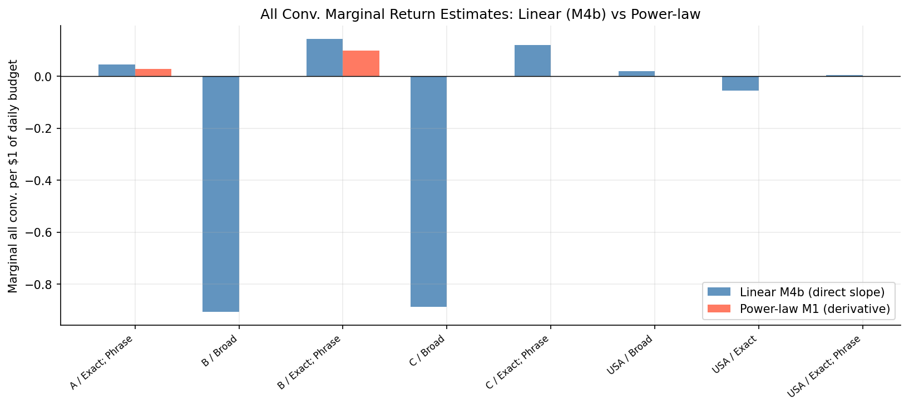

### Clicks vs. conversions correlation

| Segment | Pearson r (clicks vs. conv) | Conv/click rate |
|---|---|---|
| A / Broad | 0.06 | 2.9% |
| C / Broad | 0.04 | 2.5% |
| C / Phrase; Exact | 0.10 | 3.8% |
| USA / Phrase; Exact | 0.09 | 5.6% |
| USA / Broad | 0.23 | 6.7% |
| USA / Exact | 0.19 | 12.2% |
| B / Broad | 0.42 | 6.3% |
| B / Phrase; Exact | 0.38 | 8.3% |
| A / Phrase; Exact | 0.42 | 9.5% |

Overall r = 0.54. The low correlation in Broad segments (r < 0.1) means clicks are a poor proxy for conversions there — budget optimisation targeting clicks would be misleading for these segments.

---

## Key Takeaways for Optimization

1. **Budget reallocation headroom is real.** B / Phrase; Exact and C / Broad show the highest linear M4b click slopes; USA segments are lower at comparable budgets. The all-conv analysis still favors B / Phrase; Exact (≈0.14 conv/$1) over USA / Broad (≈0.02). Even a partial shift toward B/C would improve aggregate efficiency per dollar.

2. **Linear per-segment model (M4b) is preferred for deriving marginal returns.** It avoids the parametric power-law assumption and directly produces per-segment slopes. Use slopes only from segments with ≥3 budget levels (5 of 12) or supplement with hierarchical shrinkage toward the pooled estimate.

3. **Temporal features add signal.** Day-of-week and month are strongly significant in both clicks and all-conv models (Monday and Sep/Nov/Aug/Feb highest for clicks; Feb/Sep/Jan/Oct/Dec for conversions). Including these reduces residual noise and improves marginal-return estimates.

4. **Clicks and conversions diverge in USA and Broad segments.** USA's click elasticity (M3 b≈0.82) is high, but its conversion elasticity (b≈0.21) is the lowest of any region. Broad segments show r < 0.10 between clicks and conversions. Optimising solely for clicks in these segments would misallocate budget relative to the true objective.

5. **Keyword semantics matter more for conversions than for clicks.** `embed_course_sim_p90` is a significant positive predictor of conversions (t=3.35) but not clicks. Higher course-relevance at the p90 tail of the keyword set predicts better conversion performance, even after controlling for budget and segment.

6. **Keyword set stability is low.** Lists turn over quickly between versions (see keyword-set semantic features and stability). Keyword choice is a decision variable in the MILP (one $k \in \mathcal{K}_s$ per segment), not a pre-step “freeze”; candidates come from historical sets and `kw-day-panel.csv` validation.

7. **Joint MILP over budgets and keyword sets.** Maximize M4b predicted conversions with $\sum_s x_s \leq B$, regional spend $\sum_{s:\mathrm{USA}} x_s \geq \sum_{s:A} x_s \geq \sum_{s:B} x_s$, and $\sum_k y_{s,k}=1$. Embedding terms $\sum_k y_{s,k}\boldsymbol{\phi}_k^\top\boldsymbol{\gamma}_{\mathrm{emb}}$ encode set quality (e.g.\ course similarity for conv.).

8. **GKP features are the main missing piece.** Search volume trends, competition index, and bid ranges were identified as high-value inputs in `ad_opt` but are not yet available in this repo. A `pull_input_data.py --datasets keyword_planning` run would unlock them.

## Next Steps

1. **Keyword candidates**: for each `(region, match_type)`, build $\mathcal{K}_s$ (historical `keyword_set_id` values in segment + sets assembled from top-click and top-efficiency keywords in `kw-day-panel.csv`); pass embedding vectors $\boldsymbol{\phi}_k$ into the MILP.
2. **Pull GKP data**: add search volume, competition, and bid features to M4b.
3. **Hierarchical shrinkage**: apply partial pooling on per-segment budget slopes so data-sparse segments inherit the global estimate rather than producing noise.
4. **Solve MILP** (budgets + keyword sets; regional spend USA $\geq$ A $\geq$ B; objective = M4b all conv.).
5. **Holdout backtest**: reserve the most recent 60–90 days, refit on the earlier window, and compare predicted vs. actual clicks and conversions under chosen $(x_s, k)$.
6. **Investigate USA conversion gap**: USA has high click elasticity but very low conversion elasticity (b=0.21). Root-cause candidates: landing-page localisation, audience-match quality, or higher baseline CPC leading to lower-intent clicks at scale.
