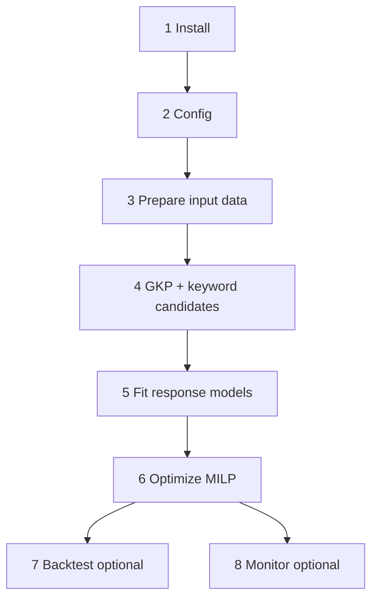

# campaign_opt

Config-driven **campaign-level** optimization: daily budget per `(region, match_types)` segment plus discrete **keyword set** choice.

Run steps **1–6** in order to produce a campaign plan. Steps **7–8** are optional validation and production monitoring.




More on API pulls and HTML parsing: root `[README.md](../README.md)`.

---

## 1. Install

Requires [uv](https://docs.astral.sh/uv/). From the repo root:

```powershell
uv sync --extra optimization --extra ml
```

The `ml` extra includes XGBoost and SHAP (signed directional effects for tree models in fit logs / `model_manifest.json`).

Run scripts with `uv run python ...` or activate the project venv:

```powershell
.\.venv\Scripts\Activate.ps1
```

Optional notebook EDA: `uv sync --extra notebook`.

Gurobi license required for optimization. Keep Google Ads credentials outside the repo (see root `[README.md](../README.md)`).

---

## 2. Config

Default experiment: `[opt_results/sys_think/campaign/default/campaign_config.json](../opt_results/sys_think/campaign/default/campaign_config.json)`

Key fields:

- `target` — `all_conv` or `clicks` (optimization objective)
- `context_features` — calendar, keyword-set semantic/GKP columns
- `constraints.regional_order` — e.g. USA ≥ A ≥ B spend
- `model_policy.validation` — `time_series_cv` with `cv_folds`, `min_train_fraction` (e.g. `0.5` = each fold trains on at least half of train-panel days), `min_val_days`, or `time_holdout` for last-N-day reporting only
- `evaluation` — `use_ensemble`, `baseline_budget`, `weight_by_cv_rmse` (plan vs actual scoring)

Copy or edit this file per course/experiment under `opt_results/<course>/campaign/<exp_name>/`.

---

## 3. Prepare input data

All paths below use `<course>` (e.g. `sys_think`). Performance and conversion data come from the **Google Ads API**; campaign budgets and negative keywords still come from saved **change-history HTML** (until a change_event API path exists).

### 3a. Pull Google Ads reports (API)

```powershell
uv run python scripts/pull_input_data.py `
  --datasets campaign_opt `
  --output-course sys_think `
  --google-ads-yaml ..\google-ads-prod.yaml `
  --customer-id 1234567890
```

Uses `min_date` from `config.py` (override with `--start-date` if needed).

→ `data/<course>/reports/kw-day-panel.csv` — clicks, cost, filtered `all_conv`

If `context_features.gkp_set` is enabled:

```powershell
uv run python scripts/build_keywords_classified.py --course sys_think
uv run python scripts/pull_input_data.py `
  --datasets campaign_opt,keyword_planning `
  --output-course sys_think `
  --keyword-planning-input-file data\sys_think\gkp\keywords_classified.csv `
  --google-ads-yaml ..\google-ads-prod.yaml `
  --customer-id 1234567890
```

### 3b. Clean keyword-day panel

```powershell
uv run python scripts/process_input_data.py --output-course sys_think
```

→ `data/<course>/processed/kw-day-panel.csv`

### 3c. Parse change history (HTML)

Save the Change history HTML under `data/<course>/`, then:

```powershell
uv run python scripts/parse_change_history_html.py --output-course sys_think
```

Uses the cleaned kw-day-panel to fill keyword inventory gaps. Writes `campaign-summary.csv` and `campaign-keyword-sets.csv` (budgets are on each summary row).

### 3d. Campaign-day panel

```powershell
uv run python scripts/generate_campaign_day_panel.py --output-course sys_think
```

→ `data/<course>/processed/campaign-day-panel.csv` — clicks, cost, and `all_conv` per campaign version (main modeling input)

---

## 4. Build GKP set features & keyword candidates

Required when `context_features.gkp_set` is set in config; otherwise use `--skip-gkp` in the pipeline.

```powershell
uv run python scripts/build_keyword_candidates.py --course sys_think
uv run python scripts/build_gkp_set_features.py --course sys_think
```

Produces set-level GKP aggregates and `data/<course>/processed/segment-keyword-candidates.csv` used by the MILP.

**Keyword candidates (`build_keyword_candidates.py`)**

- **Segment** = `(region, match_types)` where `match_types` is the campaign-level configuration from change history (`Broad`, `Phrase; Exact`, `Exact`, or `Broad; Phrase; Exact`). The MILP picks one keyword set per segment, not separate lists per match type.
- **Historical** candidates: every `keyword_set_id` observed in that segment.
- **`synthetic_top`**: union of top-click and top-efficiency keywords from `kw-day-panel.csv`, filtered to the segment’s region and allowed match types.
- **`synthetic_semantic`**: top keywords in the performance pool ranked by per-keyword course-anchor similarity (`embed_course_sim_mean` signal from EDA), sized to the segment’s median historical keyword count (override with `--set-size`).
- **`synthetic_dispersion`**: greedy subset maximizing `embed_dispersion` (spread around the set centroid).
- **`synthetic_composite`**: greedy subset maximizing `z(embed_course_sim_mean) + z(embed_dispersion)` within the pool (Model C-style).

Disable variants with `--no-semantic-synthetic`, `--no-dispersion-synthetic`, or `--no-composite-synthetic`.

Keywords **do not** need to be identical across Broad / Phrase / Exact within a campaign. Historical sets store separate `broad_keywords`, `phrase_keywords`, and `exact_keywords` columns; synthetic sets assign each keyword to a match-type column using dominant clicks in the panel. Union-level semantic/GKP features use `positive_keywords`; **match-type structure** features (counts, Jaccard overlap, per-type course similarity, cross-type embedding similarity) are computed from the split lists in `build_gkp_set_features.py` and exposed as `keyword_set_match_type` in the campaign config.

Outputs:

| File | Contents |
|------|----------|
| `segment-keyword-candidates.csv` | segment → `keyword_set_id`, `source` |
| `campaign-keyword-sets-extended.csv` | keyword lists (+ match-type columns for synthetics) |

Run **candidates first**, then **GKP/set features**, so `campaign-keyword-sets-extended.csv` exists before `build_keyword_set_feature_table()` merges synthetic sets into `keyword-set-features.csv`.

---

## 5. Fit response models

```powershell
uv run python scripts/fit_response_models.py --course sys_think
```

Tournament (ridge, power, RF, XGB) with **level-scale** metrics; writes `model_manifest.json`, `winner_model.joblib`, `holdout_metrics.json`, and **`linear_coeffs.json`** under `opt_results/<course>/campaign/<exp>/`.

**Ridge uses the same design as the linear MILP** (`segment + daily_budget + budget×segment + context_features` via `[linear_design.py](linear_design.py)`). Keyword-set selection in the MILP uses static context-feature coefficients (semantic, GKP, match-type) evaluated per candidate set — not `keyword_set_id` dummies. Saved debug matrices land in `features/`:

| File | Purpose |
|------|---------|
| `modeling_frame_train/holdout.csv` | Wide modeling frame |
| `linear_milp_design_train/holdout.csv` | Aligned ridge / MILP design matrix |
| `linear_milp_design_columns.json` | Column order for holdout reindex |
| `context_design_train/holdout.csv` | Tree-model context OHE matrix |
| `artifact_manifest.json` | Paths index |

**Model selection rules:**

1. All candidates scored on **levels** (comparable RMSE / R²).
2. With `validation.scheme: time_series_cv`, winner picked by **mean CV RMSE** on train.
3. Holdout metrics logged in `holdout_metrics.json`.
4. Tournament winner is the lowest CV RMSE (with `time_series_cv`) or lowest holdout RMSE otherwise; `optimizer_backend: auto` uses that model's backend (`linear` | `piecewise_linear` | `tree_embed`).

---

## 6. Optimize (Gurobi MILP)

```powershell
uv run python scripts/optimize_campaign.py --course sys_think --budget 400
```

By default loads **`linear_coeffs.json`** from fit time; pass `--refit-coeffs` to re-fit on current train data.

Or run steps **4–6** in one command after step 3 is complete (regenerates panel if missing):

```powershell
uv run python scripts/run_campaign_pipeline.py --course sys_think
```

Use `--skip-gkp` / `--skip-candidates` when GKP set features are disabled or already built.

---

## 7. Walk-forward backtest (optional)

### Daily mode (default)

```powershell
uv run python scripts/backtest_campaign.py --course sys_think --start 2025-10-01 --end 2025-12-31
```

One MILP per day in range (train on `date < t`, optimize budget + keyword set, score vs actual). This is the default; existing configs and invocations behave unchanged.

Optional flags: `--strategy daily` (explicit), `--static-model` (reuse first-day tournament/ensemble).

### Two-stage mode (fixed keyword sets + weekly budgets)

Operational backtest: keyword sets fixed once for the period (sum of daily predictions over `[start, end]` with budgets at historical median), then budgets re-optimized each week using the **same daily response model** — objective = sum of Mon–Sun daily predictions with constant `daily_budget` within the week.

```powershell
uv run python scripts/backtest_campaign.py --course sys_think --start 2025-10-01 --end 2025-12-31 --strategy two_stage
```

Campaign windows and course start dates are known in advance, so stage 1 uses the full period calendar (not walk-forward set selection). Stage 2 is walk-forward: train on `date < week_start`, optimize, score the week.

Config block (optional; defaults to daily if omitted):

```json
"backtest": {
  "strategy": "daily",
  "keyword_set_horizon": "period",
  "budget_cadence": "W-MON"
}
```

Outputs under `backtest/<start>_<end>/`: `fixed_keyword_sets.json`, `weekly_backtest_summary.csv`, `plans/YYYYMMDD/` per week (`plan_vs_actual_weekly.csv`, optional `plan_vs_actual_daily.csv`).

---

## 8. Production monitor & evaluation ensemble (optional)

Plan vs actual uses a **separate ensemble** (all `model_policy` candidates on available train data), not the MILP winner:


| Metric                | Definition                                                                                  |
| --------------------- | ------------------------------------------------------------------------------------------- |
| **f(0)**              | Baseline: `evaluation.baseline_budget` (default 0) + modal keyword set per segment on train |
| **pred_lift**         | f(plan) − f(0)                                                                              |
| **actual_model_lift** | f(actual budget & set) − f(0), same ensemble                                                |


Primary comparison: `pred_lift` vs `actual_model_lift`. Observed totals are reference only.

```powershell
# Fit ensemble on full history (saved for monitor)
uv run python scripts/fit_evaluation_ensemble.py --course sys_think

# Compare latest plan to actuals (uses saved ensemble or refits on pre-eval train)
uv run python scripts/monitor_campaign_production.py --course sys_think --lag 1
```

---

## MILP structure (shared core)

For each segment `s`:

- Continuous `x[s]` = daily budget (bounded by history)
- Binary `y[s,k]` = select keyword set `k`; ∑_k y[s,k] = 1

Backends differ in how per-segment predicted `target` is expressed in Gurobi (`linear`, `piecewise_linear`, exact `tree_embed` via `[backends/tree_embedding.py](backends/tree_embedding.py)`).

---

## Outputs

Under `opt_results/<course>/campaign/<exp_name>/`:

- `model_manifest.json`, `winner_model.joblib`, `holdout_metrics.json`
- `features/` — saved modeling frames and design matrices (see §5)
- `campaign_plan.csv`, `linear_coeffs.json`, `solver_status.json`
- `ensemble_model.joblib` (after `fit_evaluation_ensemble.py` or backtest with `use_ensemble`)
- Backtest (daily): `backtest/<start>_<end>/plans/YYYYMMDD/`, `plan_vs_actual.csv`, `daily_backtest_summary.csv`
- Backtest (two-stage): `fixed_keyword_sets.json`, `weekly_backtest_summary.csv`, weekly `plans/YYYYMMDD/`

---

## Package layout


| Module                                                         | Purpose                                                  |
| -------------------------------------------------------------- | -------------------------------------------------------- |
| `[schema.py](schema.py)`                                       | Load `campaign_config.json`                              |
| `[features.py](features.py)`                                   | Build modeling frame from `campaign-day-panel`           |
| `[evaluation.py](evaluation.py)`                               | Ensemble fit + incremental `f(decision)−f(0)` comparison |
| `[cv.py](cv.py)`                                               | Expanding-window time-series cross-validation            |
| `[modeling.py](modeling.py)`                                   | Model tournament with level-scale metrics                |
| `[coefficients.py](coefficients.py)`                           | Export linear coeffs for MILP objective                  |
| `[linear_design.py](linear_design.py)`                         | Shared MILP-linear design + aligned ridge                |
| `[feature_artifacts.py](feature_artifacts.py)`                 | Persist modeling / design matrices at fit time           |
| `[optimize.py](optimize.py)`                                   | Dispatch solver backend from manifest                    |
| `[backtest.py](backtest.py)`                                   | Walk-forward daily backtest loop                         |
| `[backtest_two_stage.py](backtest_two_stage.py)`               | Fixed keyword sets + weekly budget backtest              |
| `[backends/milp_core.py](backends/milp_core.py)`               | Shared Gurobi MILP                                       |
| `[backends/linear.py](backends/linear.py)`                     | Linear objective backend                                 |
| `[backends/piecewise_linear.py](backends/piecewise_linear.py)` | Piecewise budget curve backend                           |
| `[backends/tree_embed.py](backends/tree_embed.py)`             | Exact RF/XGB tree embedding in Gurobi                    |
| `[backends/tree_embedding.py](backends/tree_embedding.py)`     | Leaf-level Big-M constraints (from ad_opt)               |


