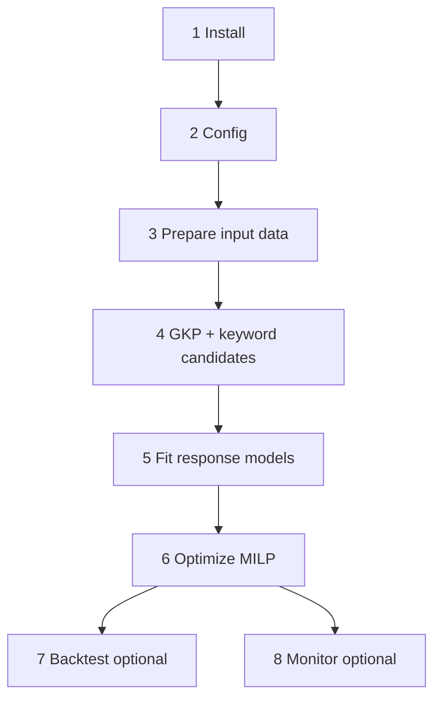

# campaign_opt

Config-driven **campaign-level** optimization: daily budget per `(region, match_types)` segment plus discrete **keyword set** choice.

Run steps **1–7** in order to produce a campaign plan. Steps **8–9** are optional validation and production monitoring.




More on API pulls and HTML parsing: root `[README.md](../README.md)`.

---

## Modeling considerations

The default optimization target is `**clicks**`, not `**all_conv**`. This follows from how the panel is built and what we can identify from history.

**Decision lever.** Response models use `**daily_budget`** (the configured cap from change history). `**cost**` is observed spend, not a controllable input, and is excluded from models and budget diagnostics.

**Limited budget variation.** Within a `campaign_version`, budget is fixed. Budget only changes when the campaign is reconfigured (new version). That gives few within-cell budget levels — mostly when the same `(segment, keyword_set_id)` appears at multiple budgets across versions. Full models that pool all rows often show a **negative budget coefficient on conversions** because budget moves coincide with keyword-set and strategy changes (Lead Gen → Run 19 prospecting), not because higher caps reduce conversions.

**Conversions are unstable over time.** `all_conv` levels and mix shifted substantially over the past two years (campaign type, match types, tracking). Time-series holdout and CV R² stay low for conversion models, and OOS forecasts are dominated by regime change rather than budget or set features.

**Clicks are more stable and identifiable.** On identifiable `(segment, keyword_set_id)` cells, within-set budget slopes for clicks are typically **positive**. Clicks respond more directly to auction volume at a given cap, so they are a better proxy for the budget lever even when conversion efficiency moves.

**Implication for config.** Set `target: clicks` for optimization and MILP objectives. Keep `all_conv` in `secondary_metrics` for reporting and diagnostics. Run `diagnose_budget_response.py` before trusting budget signs in fitted coefficients. Holdout R² on segment-day clicks (~0.3 for tree models) is expected to stay well below in-sample presentation benchmarks; prioritize correct budget direction and relative ranking over chasing high R².

---

## 1. Install

Requires [uv](https://docs.astral.sh/uv/). From the repo root:

```powershell
uv sync --extra optimization --extra ml
```

The `ml` extra includes XGBoost and SHAP (signed directional effects for tree models in fit logs / `model_manifest.json`).

Run scripts with `uv run python ...` or activate the project venv:

```powershell
.\.venv\Scripts\Activate.ps1
```

Optional notebook EDA: `uv sync --extra notebook`.

Gurobi license required for optimization. Keep Google Ads credentials outside the repo (see root `[README.md](../README.md)`).

---

## 2. Config

Default experiment: `[opt_results/sys_think/campaign/default/campaign_config.json](../opt_results/sys_think/campaign/default/campaign_config.json)`

Key fields:

- `target` — optimization objective; default `**clicks**` (see [Modeling considerations](#modeling-considerations)). Supported values: `clicks`, `all_conv`, and `conv_scaled_clicks` (clicks scaled by historical conversion-per-click by `(region, match_types)` with global fallback for zero-click segments). Use `secondary_metrics` to track conversions alongside clicks.
- `context_features` — calendar, keyword-set semantic/GKP columns
- `constraints.regional_order` — e.g. USA ≥ A ≥ B spend
- `constraints.budget_tiebreak_penalty` — optional (default `1e-8`); subtract `penalty × Σ daily_budget` from the MILP objective so equal predicted-target solutions prefer lower total spend
- `model_policy.validation` — `time_series_cv` with `cv_folds`, `min_train_fraction` (e.g. `0.5` = each fold trains on at least half of train-panel days), `min_val_days`, or `time_holdout` for last-N-day reporting only
- `evaluation` — `use_ensemble`, `baseline_budget`, `weight_by_cv_rmse`, `objective` (`levels` or `incremental`), `apply_observed_budget_floor` (zero optimizer preds when budget &lt; min historical cap; does not change holdout R²), optional `max_level_ub` (McCormick cap for tree backends), `milp_external_level_tol` (default `0.01`, MILP vs gated sklearn level check)

Copy or edit this file per course/experiment under `opt_results/<course>/campaign/<exp_name>/`.

---

## 3. Prepare input data

All paths below use `<course>` (e.g. `sys_think`). Performance and conversion data come from the **Google Ads API**; campaign budgets and negative keywords still come from saved **change-history HTML** (until a change_event API path exists).

### 3a. Pull Google Ads reports (API)

```powershell
uv run python scripts/pull_input_data.py `
  --datasets campaign_opt `
  --output-course sys_think `
  --google-ads-yaml ..\google-ads-prod.yaml `
  --customer-id 1234567890
```

Uses `min_date` from `config.py` (override with `--start-date` if needed).

→ `data/<course>/reports/kw-day-panel.csv` — clicks, cost, filtered `all_conv`

If `context_features.gkp_set` is enabled:

```powershell
uv run python scripts/build_keywords_classified.py --course sys_think
uv run python scripts/pull_input_data.py `
  --datasets campaign_opt,keyword_planning `
  --output-course sys_think `
  --keyword-planning-input-file data\sys_think\gkp\keywords_classified.csv `
  --google-ads-yaml ..\google-ads-prod.yaml `
  --customer-id 1234567890
```

### 3b. Clean keyword-day panel

```powershell
uv run python scripts/process_input_data.py --output-course sys_think
```

→ `data/<course>/processed/kw-day-panel.csv`

### 3c. Parse change history (HTML)

Save the Change history HTML under `data/<course>/`, then:

```powershell
uv run python scripts/parse_change_history_html.py --output-course sys_think
```

Uses the cleaned kw-day-panel to fill keyword inventory gaps. Writes `campaign-summary.csv` and `campaign-keyword-sets.csv` (budgets are on each summary row).

### 3d. Campaign-day panel

```powershell
uv run python scripts/generate_campaign_day_panel.py --output-course sys_think
```

→ `data/<course>/processed/campaign-day-panel.csv` — clicks, cost, and `all_conv` per campaign version (main modeling input)

---

## 4. Build GKP set features & keyword candidates

Required when `context_features.gkp_set` is set in config; otherwise use `--skip-gkp` in the pipeline.

```powershell
uv run python scripts/build_keyword_candidates.py --course sys_think
uv run python scripts/build_gkp_set_features.py --course sys_think
```

Produces set-level GKP aggregates and `data/<course>/processed/segment-keyword-candidates.csv` used by the MILP.

**Keyword candidates (`build_keyword_candidates.py`)**

- **Segment** = `(region, match_types)` where `match_types` is the campaign-level configuration from change history (`Broad`, `Phrase; Exact`, `Exact`, or `Broad; Phrase; Exact`). The MILP picks one keyword set per segment, not separate lists per match type.
- **Historical** candidates: every `keyword_set_id` observed in that segment.
- `**synthetic_top_conv**`: union of top `all_conv` and conversion-efficiency keywords from `kw-day-panel.csv` (positive `all_conv` only, allowlist-restricted when present). If fewer than `top_n` converters exist, pads with the next highest-priority enrollment allowlist keywords (by enrollment count in the GKP file, else sheet order). Match-type columns use dominant `all_conv` per keyword. Semantic/dispersion/composite pools also use this pool.
- `**synthetic_allowlist**`: all keywords from `*Keywords*Enrollments*.xlsx` (one set per segment; match types assigned from the panel when possible). Only emitted when that file exists.
- Multiple `top_n` caps: `--top-n-values 10,20,40` adds `synthetic_top_conv_n10`, `_n20`, `_n40`, `synthetic_allowlist_n10`, etc. (and matching semantic/dispersion/composite variants) per segment. Allowlist sets use the first N keywords by enrollment priority from the GKP file.
- `**synthetic_semantic**`: top keywords in the performance pool ranked by per-keyword course-anchor similarity (`embed_course_sim_mean` signal from EDA), sized to the segment’s median historical keyword count (override with `--set-size`).
- `**synthetic_dispersion**`: greedy subset maximizing `embed_dispersion` (spread around the set centroid).
- `**synthetic_composite**`: greedy subset maximizing `z(embed_course_sim_mean) + z(embed_dispersion)` within the pool (Model C-style).

Disable variants with `--no-semantic-synthetic`, `--no-dispersion-synthetic`, or `--no-composite-synthetic`.

Keywords **do not** need to be identical across Broad / Phrase / Exact within a campaign. Historical sets store separate `broad_keywords`, `phrase_keywords`, and `exact_keywords` columns; synthetic sets assign each keyword to a match-type column using dominant clicks in the panel. Union-level semantic/GKP features use `positive_keywords`; **match-type structure** features (counts, Jaccard overlap, per-type course similarity, cross-type embedding similarity) are computed from the split lists in `build_gkp_set_features.py` and exposed as `keyword_set_match_type` in the campaign config.

Outputs:


| File                                 | Contents                                            |
| ------------------------------------ | --------------------------------------------------- |
| `segment-keyword-candidates.csv`     | segment → `keyword_set_id`, `source`                |
| `campaign-keyword-sets-extended.csv` | keyword lists (+ match-type columns for synthetics) |


Run **candidates first**, then **GKP/set features**, so `campaign-keyword-sets-extended.csv` exists before `build_keyword_set_feature_table()` merges synthetic sets into `keyword-set-features.csv`.

**Budget diagnostics** (before trusting budget coefficients):

```powershell
uv run python scripts/diagnose_budget_response.py --course sys_think
```

Compares `all_conv` vs `clicks` (ridge + XGB) and within-`(segment, keyword_set_id)` **daily_budget** slopes. Outputs under `opt_results/<course>/campaign/<exp>/diagnostics/budget/`. Cost is not used in response models or these diagnostics.

**Calendar ablation** (season vs month vs sin/cos month):

```powershell
uv run python scripts/diagnose_budget_response.py --course sys_think --calendar-ablation --ablation-target clicks
```

Writes `diagnostics/budget/calendar_ablation/calendar_ablation.csv` with CV RMSE and holdout R² per spec.

---

## 5. Fit response models

```powershell
uv run python scripts/fit_response_models.py --course sys_think
```

Tournament (ridge, power, RF, XGB) with **level-scale** metrics; writes `model_manifest.json`, `winner_model.joblib`, `holdout_metrics.json`, and `**linear_coeffs.json`** under `opt_results/<course>/campaign/<exp>/`.

**Ridge uses the same design as the linear MILP** (`region + match_type + budget×(region + match) + context_features` via `[linear_design.py](linear_design.py)`). Keyword-set selection in the MILP uses `**static_context_lift`** — per-set scores derived from static context-feature coefficients (semantic, GKP), not `keyword_set_id` dummies. Saved debug matrices land in `features/`:


| File                                   | Purpose                            |
| -------------------------------------- | ---------------------------------- |
| `modeling_frame_train/holdout.csv`     | Wide modeling frame                |
| `linear_milp_design_train/holdout.csv` | Aligned ridge / MILP design matrix |
| `linear_milp_design_columns.json`      | Column order for holdout reindex   |
| `context_design_train/holdout.csv`     | Tree-model context OHE matrix      |
| `artifact_manifest.json`               | Paths index                        |


**Model selection rules:**

1. All candidates scored on **levels** (comparable RMSE / R²).
2. With `validation.scheme: time_series_cv`, winner picked by **mean CV RMSE** on train.
3. Holdout metrics logged in `holdout_metrics.json`.
4. Tournament winner is the lowest CV RMSE (with `time_series_cv`) or lowest holdout RMSE otherwise; `optimizer_backend: auto` uses that model's backend (`linear` | `piecewise_linear` | `tree_embed`).

---

## 6. Fit evaluation ensemble (plan vs actual scoring)

```powershell
uv run python scripts/fit_evaluation_ensemble.py --course sys_think
```

Fits the 5-member ensemble on the **full modeling panel** with CV-RMSE weights from `holdout_metrics.json` (same as backtest). Writes `ensemble_model.joblib` and `ensemble_meta.json`.

## 7. Optimize (Gurobi MILP)

```powershell
uv run python scripts/optimize_campaign.py --course sys_think --budget 400
```

Walk-forward train (`date < planning_date`), **3-fold time-series CV** hyperparameter tuning, then MILP with `optimizer_winner` (default `ensemble_ridge_xgb` / `tree_embed`). Optional `--planning-date YYYY-MM-DD` (default: latest panel date).

Or run steps **4–7** in one command after step 3 is complete (regenerates panel if missing):

```powershell
uv run python scripts/run_campaign_pipeline.py --course sys_think
```

Use `--skip-gkp` / `--skip-candidates` when GKP set features are disabled or already built.

---

## 8. Walk-forward backtest (optional)

### Daily mode (default)

```powershell
uv run python scripts/backtest_campaign.py --course sys_think --start 2025-10-01 --end 2025-12-31
```

One MILP per day in range: fit the **optimizer** on walk-forward train (`date < t`) with time-series CV hyperparameter search, embed in Gurobi, then optimize budget + keyword set. Requires `fit_response_models.py` artifacts (`model_manifest.json`, `holdout_metrics.json` when `evaluation.weight_by_cv_rmse` is true). The **evaluation** scorer is fit **once on the full modeling panel**—saved as `ensemble_model.joblib` or `evaluation_{model}.joblib`.

Optional flags: `--strategy daily` (explicit).

### Two-stage mode (fixed keyword sets + weekly budgets)

Operational backtest: keyword sets fixed once for the period (multi-day linear MILP over `[start, end]`), then budgets re-optimized each week with those sets fixed. Multi-day MILP uses the **linear** backend; daily production optimization uses the configured backend (e.g. `tree_embed`).

```powershell
uv run python scripts/backtest_campaign.py --course sys_think --start 2025-10-01 --end 2025-12-31 --strategy two_stage
```

Campaign windows and course start dates are known in advance, so stage 1 uses the full period calendar (not walk-forward set selection). Stage 2 is walk-forward: train on `date < week_start`, optimize, score the week.

Config block (optional; defaults to daily if omitted):

```json
"backtest": {
  "strategy": "daily",
  "keyword_set_horizon": "period",
  "budget_cadence": "W-MON"
}
```

Outputs under `backtest/<start>_<end>/`: `fixed_keyword_sets.json`, `weekly_backtest_summary.csv`, `plans/YYYYMMDD/` per week (`plan_vs_actual_weekly.csv`, optional `plan_vs_actual_daily.csv`).

### Summarize performance

After a backtest window finishes, compile daily evaluation rows and write summary tables (CSV + LaTeX):

```powershell
uv run python scripts/analyze_backtest_results.py --course sys_think --start 2025-10-06 --end 2025-10-12
```

Or pass `--analyze` to `backtest_campaign.py` after a local full-window run. Outputs:

- `evaluation_results.csv` — daily totals (`pred_lift`, `actual_model_lift`, observed, budgets)
- `backtest_summary.csv` — Model / Actual rows with conversions, budget, conv/$, and improvement % 
- `regional_breakdown.csv` — opt vs actual spend/lift shares by region
- `backtest_summary.tex` — LaTeX performance table

On a cluster, run one `backtest_campaign.py` job per day with `--day YYYY-MM-DD`, then `analyze_backtest_results.py` after the window completes.

---

## 9. Production monitor (optional)

Plan vs actual uses the **evaluation ensemble** (5 tournament members, CV-RMSE weights from `holdout_metrics.json`), not the MILP optimizer model:


| Metric                | Definition                                                                                  |
| --------------------- | ------------------------------------------------------------------------------------------- |
| **f(0)**              | `evaluation.baseline_budget` (default 0) + **same keyword set** as the row being scored (plan set for Model, campaign set for Actual) |
| **pred_lift**         | f(plan budget, plan set) − f(0 with plan set), clipped at 0                               |
| **pred_lift_raw**     | Same, signed (saved in `plan_vs_actual.csv`)                                                |
| **actual_model_lift** | f(actual **campaign budget** `daily_budget`, actual set) − f(0 with actual set); not `cost`; clipped |
| **actual_model_lift_raw** | Signed market-row incremental (saved in `plan_vs_actual.csv`)                           |


Primary comparison: `pred_lift` vs `actual_model_lift`. Observed totals are reference only.

```powershell
# Fit ensemble on full history (saved for monitor)
uv run python scripts/fit_evaluation_ensemble.py --course sys_think

# Compare latest plan to actuals (loads ensemble_model.joblib or fits via fit_evaluation_model)
uv run python scripts/monitor_campaign_production.py --course sys_think --lag 1
# Force refit after new panel data:
uv run python scripts/monitor_campaign_production.py --course sys_think --lag 1 --refit-ensemble
```

---

## MILP structure (shared core)

For each segment `s`:

- Continuous `x[s]` = daily budget (bounded by history)
- Binary `y[s,k]` = select keyword set `k`; ∑_k y[s,k] = 1

Backends differ in how per-segment predicted `target` is expressed in Gurobi (`linear`, `piecewise_linear`, exact `tree_embed` via `[backends/tree_embedding.py](backends/tree_embedding.py)`).

**Objective:** controlled by `evaluation.objective`:
- `levels` (default for `conv_scaled_clicks` configs): maximize `Σ_s f_s(plan)` minus budget tie-break.
- `incremental`: maximize `Σ_s [f_s(plan) − f_s(baseline)]` at `evaluation.baseline_budget` (same keyword set).

When `evaluation.apply_observed_budget_floor` is true, each `f_s` is gated to **0** below the segment's minimum observed `daily_budget` in the training panel (McCormick constraints in `milp_core` only; tree leaf embedding unchanged). Plan-vs-actual and `external_model_pred` use the same numpy floor via `optimizer_prediction.py`. Holdout model fit / R² stay on ungated sklearn predictions.

Subtract `constraints.budget_tiebreak_penalty` (default `1e-8`) × Σ daily budgets to break ties toward lower spend.

For `ensemble_ridge_xgb`, each candidate baseline `f_k(baseline)` is `EnsembleModel.predict_levels` on the same `build_segment_decision_rows` features used in backtest scoring (not a separate analytic formula).

---

## Outputs

Under `opt_results/<course>/campaign/<exp_name>/`:

- `model_manifest.json`, `winner_model.joblib`, `holdout_metrics.json`
- `features/` — saved modeling frames and design matrices (see §5)
- `campaign_plan.csv`, `linear_coeffs.json`, `solver_status.json`

`campaign_plan.csv` columns:


| Column                | Meaning                                                                                                                                                                                  |
| --------------------- | ---------------------------------------------------------------------------------------------------------------------------------------------------------------------------------------- |
| `milp_pred`           | Level prediction from the solver embedding at the optimum: `f(plan)` (Gurobi value of `pred_vars[segment]`; what the MILP maximizes, up to the budget tie-break)                       |
| `pred_over_base`      | Incremental lift `f(plan) - f(0)` in solver space; `f(0)` uses the **same chosen keyword set** with `daily_budget = 0`                                                                   |
| `external_model_pred` | After solve: same **objective-side** gated level as the MILP (raw sklearn level, then 0 if `daily_budget` &lt; min observed cap on `panel`); warns if `|milp_pred - external_model_pred| > evaluation.milp_external_level_tol` (default `0.01`) |
| `n_planning_days`     | Number of calendar days whose predictions are summed in the MILP objective (1 for single-day optimize; 7 for weekly two-stage budget solve)                                              |

`milp_pred` and `external_model_pred` are **level** predictions. Use `pred_over_base` for incremental lift aligned with backtest `pred_lift` (same keyword set, zero budget baseline). Linear/piecewise runs leave `external_model_pred` empty.


- `ensemble_model.joblib` (after `fit_evaluation_ensemble.py` or backtest with `use_ensemble`)
- Backtest (daily): `backtest/<start>_<end>/plans/YYYYMMDD/`, `plan_vs_actual.csv`, `daily_backtest_summary.csv`
- Backtest (two-stage): `fixed_keyword_sets.json`, `weekly_backtest_summary.csv`, weekly `plans/YYYYMMDD/`
- Backtest analysis: `evaluation_results.csv`, `backtest_summary.csv`, `regional_breakdown.csv`, `backtest_summary.tex`

---

## Package layout


| Module                                                         | Purpose                                                  |
| -------------------------------------------------------------- | -------------------------------------------------------- |
| `[schema.py](schema.py)`                                       | Load `campaign_config.json`                              |
| `[features.py](features.py)`                                   | Build modeling frame from `campaign-day-panel`           |
| `[evaluation.py](evaluation.py)`                               | Ensemble fit + incremental `f(decision)−f(0)` comparison |
| `[cv.py](cv.py)`                                               | Expanding-window time-series cross-validation            |
| `[modeling.py](modeling.py)`                                   | Model tournament with level-scale metrics                |
| `[coefficients.py](coefficients.py)`                           | Export linear coeffs for MILP objective                  |
| `[linear_design.py](linear_design.py)`                         | Shared MILP-linear design + aligned ridge                |
| `[feature_artifacts.py](feature_artifacts.py)`                 | Persist modeling / design matrices at fit time           |
| `[optimize.py](optimize.py)`                                   | Dispatch solver backend from manifest                    |
| `[backtest_analysis.py](backtest_analysis.py)`                 | Compile plan vs actual + summary / LaTeX tables          |
| `[backtest.py](backtest.py)`                                   | Walk-forward daily backtest loop                         |
| `[backtest_two_stage.py](backtest_two_stage.py)`               | Fixed keyword sets + weekly budget backtest              |
| `[backends/milp_core.py](backends/milp_core.py)`               | Shared Gurobi MILP                                       |
| `[backends/linear.py](backends/linear.py)`                     | Linear objective backend                                 |
| `[backends/piecewise_linear.py](backends/piecewise_linear.py)` | Piecewise budget curve backend                           |
| `[backends/tree_embed.py](backends/tree_embed.py)`             | Exact RF/XGB tree embedding in Gurobi                    |
| `[backends/tree_embedding.py](backends/tree_embedding.py)`     | Leaf-level Big-M constraints (from ad_opt)               |


