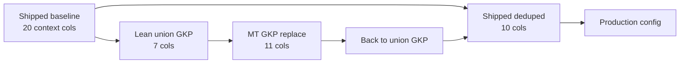

# Feature selection and modeling decisions (`sys_think` / `default`)

This document records how the **default** experiment chose context features, hyperparameters, and the optimizer model. It complements [cross_validation.md](cross_validation.md) (fold design) and the ablation scripts under `scripts/`.

**Production config:** [`sys_think/opt_results/campaign/default/campaign_config.json`](../sys_think/opt_results/campaign/default/campaign_config.json)

**Canonical feature spec in code:** `SHIPPED_DEDUPED_CONTEXT` in [`utils/campaign_features.py`](../utils/campaign_features.py) (mirrored as `RECOMMENDED_CONTEXT` in [`campaign_opt/feature_ablation.py`](../campaign_opt/feature_ablation.py)).

---

## Summary (current production)

| Item | Choice |
|------|--------|
| **Target** | `conv_scaled_clicks` — `clicks × conv_per_click` per segment, where `conv_per_click = sum(all_conv) / sum(clicks)` over the full campaign-day panel |
| **Segment conv/click rates** | `data/processed/segment-conv-per-click-rates.csv` (exported by `prepare-data`; read at modeling time) |
| **Context features** | 10 columns (shipped 20 minus correlated/redundant; see below) |
| **Optimizer model** | `xgboost` (`optimizer_winner`; fixed in config, not auto-switched from tournament) |
| **Evaluation model** | `xgboost` (`evaluation.use_ensemble: false`) |
| **CV tuning** | On (`tune_hyperparams: true`); grids in [`train_specs.py`](../utils/train_specs.py) |
| **Primary ablation metric** | CV RMSE (levels) for feature comparisons |
| **Holdout** | 75-day recent window; used as a generalization check (both CV and holdout R² should stay positive when possible) |

**XGBoost (tuned, deduped 10-feat, ~1484 panel rows)** — refit after grid tightening:

| Metric | Value |
|--------|------:|
| CV R² | 0.423 |
| Holdout R² | 0.248 |
| Tuned params | `n_estimators=20`, `max_depth=3`, `learning_rate=0.1` |

Ridge uses the same linear design as the linear MILP. **Keyword-set lift** (`static_context_lift`) includes all keyword-set-varying config columns (currently 7 of 10 context features — everything except calendar). Tree-embed MILP (XGB) uses the same columns via `build_keyword_set_feature_table()`.

---

## Decision principles

1. **Feature ablation:** Prefer **CV RMSE** on the train panel when comparing specs (same 3-fold expanding-window schedule as the tournament).
2. **Generalization:** After narrowing features, check that **holdout R²** does not collapse when CV tuning is enabled. Aggressive trees (`max_depth=4`, high `learning_rate`) improved CV but hurt holdout on lean feature sets.
3. **Simplicity:** Drop columns that are redundant (high correlation) or add no CV lift in leave-one-out / drop-group ablations.
4. **MILP alignment:** Keyword-set lift and tree-embed candidate rows use the same keyword-set-varying columns as modeling (`keyword_set_static` + `gkp_set` + `match_type_set`). Calendar is planning-date specific, not per-set.
5. **No `bid_low_mean`:** Union and per-MT bid-low columns were excluded; searches + competition means only.

---

## Feature evolution



| Stage | Context cols | Notes |
|-------|-------------:|-------|
| **Shipped baseline** | 20 | Original default: full calendar, union semantic+GKP, MT counts + MT dispersion |
| **Lean union GKP** | 7 | Dropped weekend/holiday, `days_since_version_start`, cohesion/dispersion/p90, `bid_low`, entire `match_type_set` |
| **MT GKP replace** | 11 | Swapped union GKP → per-MT searches/competition means; CV gain when tuned, holdout hurt |
| **Shipped deduped** | 10 | Shipped 20 minus correlated groups; **current production** |

---

## Shipped baseline (20 features)

Defined as `SHIPPED_CONTEXT` in `feature_ablation.py`:

| Group | Columns |
|-------|-----------|
| **calendar** (6) | `day_of_week`, `season`, `is_weekend`, `is_public_holiday`, `days_to_next_course_start`, `days_since_version_start` |
| **keyword_set_static** (5) | `embed_cohesion`, `embed_dispersion`, `embed_course_sim_mean`, `embed_course_sim_p90`, `num_unique_keywords` |
| **gkp_set** (3) | `last_month_searches_mean`, `competition_index_mean`, `bid_low_mean` |
| **match_type_set** (6) | `n_broad`, `n_phrase`, `n_exact`, `embed_dispersion_broad`, `embed_dispersion_phrase`, `embed_dispersion_exact` |

Plus always (not in `context_features`): `daily_budget`, `region`, `is_broad_match`.

---

## Production: shipped deduped (10 features)

| Group | Kept | Removed from shipped (reason) |
|-------|------|-------------------------------|
| **calendar** (3) | `day_of_week`, `season`, `days_to_next_course_start` | `is_weekend`, `is_public_holiday` (redundant with DOW); `days_since_version_start` (drop improved CV in ablation) |
| **keyword_set_static** (2) | `embed_course_sim_mean`, `num_unique_keywords` | `embed_cohesion`, `embed_dispersion`, `embed_course_sim_p90` (\|r\| > 0.85 with mean / counts; no CV lift when dropped) |
| **gkp_set** (2) | `last_month_searches_mean`, `competition_index_mean` | `bid_low_mean` (correlated with competition; excluded by policy) |
| **match_type_set** (3) | `embed_dispersion_broad`, `_phrase`, `_exact` | `n_broad`, `n_phrase`, `n_exact` (correlated with `num_unique_keywords`; tied CV when swapped) |

**Correlation check:** pairwise \|r\| ≥ 0.7 among shipped columns showed tight clusters (counts ↔ `num_unique_keywords`, union dispersion ↔ MT dispersion, GKP stats ↔ counts). Representative columns were kept per cluster.

**Ablation note:** On XGB (untuned), deduped 10-feat tied lean 7-feat (CV R² ≈ 0.357, holdout R² ≈ 0.223). Full shipped 20 had the **smallest CV–holdout R² gap** (~0.09) but lower CV R² (~0.32). Deduped 10 was chosen as the balance of parsimony and performance.

---

## Union GKP vs per-match-type GKP

| Comparison | XGB CV RMSE (tuned) | XGB holdout R² | Verdict |
|------------|--------------------:|---------------:|---------|
| Union GKP (7-feat lean) | 0.365 | 0.058 | Baseline lean + tuning |
| MT GKP replace (6 searches/comp cols per MT) | 0.354 | −0.20 | CV win, holdout fail |
| Union vs MT on **same** lean base (untuned) | tied ~0.390 | ~0.22 | No CV gain for swap |

**Decision:** Keep **union `gkp_set`** (2 columns). Per-MT GKP is useful in isolation but does not improve holdout on the lean config and does not feed ridge MILP set lift.

Scripts: `scripts/run_lean_gkp_ablation.py` → `diagnostics/feature_ablation/mt_gkp_lean_tuned/`.

---

## Historical keyword efficiency (tried, not shipped)

**Decision:** Keep the **original deduped 10** context features in production. Do **not** add `keyword_efficiency` to `campaign_config.json`.

We tested causal features from `kw-day-panel`: per-keyword `conv_scaled/cost` (or `/ daily_budget`), aggregated over 7/14/30d or last observed day, then mean/std/vol across keywords in the set (union or per match type). Full write-up: [keyword_efficiency_experiments.md](keyword_efficiency_experiments.md).

| Finding | Detail |
|---------|--------|
| Best CV candidate | `add_r7d_per_mt_mean_cost` — `hist_kw_eff_r7d_{broad,phrase,exact}_mean_cost` |
| Tuned XGB CV | 0.309 vs baseline 0.362 (−0.053 RMSE) |
| Tuned XGB holdout R² | **0.096** vs baseline **0.248** → not shipped |
| Lagged segment `cost` | Does not explain the lift; not recommended |
| Volatility (`vol`) | No benefit vs mean-only |
| `_cost` suffix | Denominator for **efficiency ratio**, not raw spend |

```powershell
uv run python scripts/run_efficiency_ablation.py --course sys_think --only-spec add_r7d_per_mt_mean_cost --tune
uv run python scripts/diagnose_efficiency_vs_lagged_spend.py --course sys_think
```

Code: `utils/keyword_efficiency_features.py`, `campaign_opt/efficiency_ablation.py`. Saved runs under `diagnostics/efficiency_ablation/` and `efficiency_ablation_tuned/`.

---

## Model and hyperparameter policy

### Optimizer and evaluation

- **`optimizer_winner: xgboost`** — tree backend for MILP (`tree_embed`).
- Tournament may select another candidate by CV RMSE; config warns if `optimizer_winner` ≠ manifest winner.
- **`evaluation.use_ensemble: false`** — evaluation fits the same XGB model on the full panel.

### Hyperparameter grids (`utils/train_specs.py`)

Tuning minimizes **CV RMSE** over the grid below (same folds as tournament). Grids were tightened after CV-only tuning overfit holdout on lean specs.

| Model | Grid |
|-------|------|
| **Ridge** (and power_* ) | `alpha`: **10, 100** |
| **XGBoost** | `n_estimators`: **5, 10, 20**; `max_depth`: **2, 3** (no 4); `learning_rate`: **0.1, 0.3** |
| **Random forest** | Same tree depth/estimators as XGB + `min_samples_leaf`: 10, 20 |

**Why no `max_depth=4`:** Tuned depth-4 models improved CV R² on 7–10 feature specs but holdout R² dropped sharply (CV–holdout gap ~0.25+).

**Ridge `alpha`:** `[1, 10, 100]` allowed α=1 and destabilized holdout on deduped features (holdout R² ≪ 0). `[10, 100]` is used for all ridge-family models.

### Tournament selection nuance

With `scheme: time_series_cv`, the tournament ranks candidates by **CV RMSE** even when `selection_metric` is named `holdout_rmse_levels`. See [cross_validation.md](cross_validation.md). Holdout metrics are logged in `holdout_metrics.json` for diagnostics.

---

## Ablation tooling

| Script | Specs | Output |
|--------|-------|--------|
| [`scripts/run_feature_ablation.py`](../scripts/run_feature_ablation.py) | Full grid (`FEATURE_ABLATION_SPECS`: shipped, drops, additive MT/GKP, `recommended_config`) | `diagnostics/feature_ablation/` (+ `_tuned/` with `--tune`) |
| [`scripts/run_match_type_ablation.py`](../scripts/run_match_type_ablation.py) | MT counts, GKP, semantic | `diagnostics/match_type_ablation/` |
| [`scripts/run_lean_gkp_ablation.py`](../scripts/run_lean_gkp_ablation.py) | Union vs MT GKP on lean/deduped base | `diagnostics/feature_ablation/mt_gkp_lean/` |
| [`scripts/run_shipped_dedup_compare.py`](../scripts/run_shipped_dedup_compare.py) | Shipped 20 vs deduped 10 vs lean 7 | `diagnostics/feature_ablation/shipped_deduped/` |
| [`scripts/run_efficiency_ablation.py`](../scripts/run_efficiency_ablation.py) | Historical kw efficiency (subset/full; `--only-spec`; `--tune`) | `diagnostics/efficiency_ablation/` — **not in production config** |
| [`scripts/diagnose_efficiency_vs_lagged_spend.py`](../scripts/diagnose_efficiency_vs_lagged_spend.py) | Efficiency vs lagged segment cost / budget confound | `diagnostics/spend_regime/` |

Example:

```powershell
uv run python scripts/run_feature_ablation.py --course sys_think --tune --models xgboost,ridge
uv run python scripts/run_shipped_dedup_compare.py --tune --models xgboost,ridge
```

Module reference: [`campaign_opt/feature_ablation.py`](../campaign_opt/feature_ablation.py), [`campaign_opt/match_type_ablation.py`](../campaign_opt/match_type_ablation.py).

---

## Metrics reference (XGB, `conv_scaled_clicks`)

Approximate results on the full panel (~1484 rows, 75-day holdout). Use as orientation only — re-run ablations after data or config changes.

| Spec | Tuning | CV R² | Holdout R² | Gap |
|------|--------|------:|-----------:|----:|
| Shipped 20 | off | 0.32 | 0.23 | 0.09 |
| Deduped 10 | off | 0.36 | 0.22 | 0.13 |
| Deduped 10 | on (old grid, depth 4) | 0.41 | 0.15 | 0.26 |
| Deduped 10 | on (**current grid**) | **0.42** | **0.25** | 0.17 |
| Shipped 20 | on (old grid) | 0.36 | 0.20 | 0.16 |

---

## Code map

| Symbol | Location |
|--------|----------|
| `SHIPPED_CONTEXT` | `feature_ablation.py` — 20-feat ablation baseline |
| `SHIPPED_DEDUPED_CONTEXT` | `utils/campaign_features.py` — production 10-feat spec |
| `RECOMMENDED_CONTEXT` | `feature_ablation.py` — copy of deduped spec for ablation |
| `DEFAULT_HYPERPARAM_GRIDS` | `utils/train_specs.py` |
| `tune_hyperparams` | `hyperparam_cv.py` |
| `static_context_columns` | `utils/linear_design.py` — keyword-set-varying context (`keyword_set_static`, `gkp_set`, `match_type_set`) |

---

## When to revisit

- **New keyword sets** with more variation across broad/phrase/exact lists → re-check MT dispersion and MT GKP swaps.
- **Regime change** in holdout window → prefer holdout-aligned tuning or nested validation, not CV-only grids.
- **Ridge MILP set choice** → if GKP signal in set ranking matters, avoid moving GKP exclusively into `match_type_set`.
- **Keyword efficiency** → only if holdout/backtest improve with the 3-column per-MT r7d spec; see [keyword_efficiency_experiments.md](keyword_efficiency_experiments.md).
